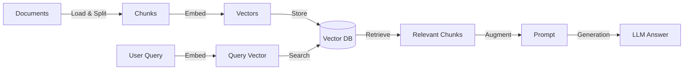

# Retrieval-Augmented Generation (RAG) Mastery Guide

This guide covers the theoretical foundations of RAG, its architecture, advanced strategies to maximize accuracy, and practical implementation details critical for interviews and system design.

---

## 1. Overview
### What is RAG?
Retrieval-Augmented Generation (RAG) is an architecture that enhances a Large Language Model (LLM) by referencing an authoritative, external knowledge base before generating a response. Instead of relying solely on the model’s internal parameters (which can be hallucinated or stale), RAG "grounds" the model in retrieved documents to ensure factual, up-to-date answers.

### Why do we need it?
*   **Hallucinations:** LLMs can confidently invent facts. RAG forces the model to use provided context.
*   **Knowledge Cutoff:** LLMs are frozen in time (e.g., trained up to 2023). RAG allows access to live data.
*   **Domain Specificity:** Enterprises need LLMs to reason over proprietary documents (PDFs, Wikis) that the model never saw during training.
*   **Cost & Privacy:** Fine-tuning is expensive and static; RAG allows you to simply update the database.

---

## 2. Core Architecture

The RAG pipeline consists of two main loops: **Ingestion** (Indexing) and **Retrieval & Generation**.

### Diagram



### Phase 1: Ingestion (Indexing)
1.  **Load:** Import data (PDFs, SQL, Web pages).
2.  **Split (Chunking):** Break text into smaller pieces (e.g., 200–1000 tokens).
    *   *Why?* Smaller chunks = higher semantic precision. LLMs have context limits, and you don't want to fill the prompt with irrelevant noise.
3.  **Embed:** Convert text chunks into **Vectors** (lists of floating-point numbers) using an Embedding Model (e.g., `text-embedding-3-small`, `BERT`).
    *   *Concept:* Semantic meaning is encoded in vector space.
4.  **Store:** Save vectors and metadata (source, page number) in a **Vector Database** (e.g., Pinecone, Chroma, Milvus).

### Phase 2: Retrieval & Generation
1.  **Query Embedding:** Convert user question into a vector using the *same* model as ingestion.
2.  **Retrieval:** Find "Nearest Neighbors" using metrics like **Cosine Similarity** or **Dot Product**.
3.  **Augmentation:** Construct a prompt containing the retrieved context.
    ```text
    You are an assistant. Answer the question using ONLY the context below:
    Context: {Retrieved Chunks}
    Question: {User Query}
    ```
4.  **Generation:** The LLM generates the answer based on the context.

---

## 3. How to Increase Accuracy

Improving accuracy is almost always about improving **Retrieval Quality**.

### A. Retrieval Optimization
*   **Better Chunking:** Use **Recursive Character Split** (respects paragraphs/sentences) or **Semantic Chunking** (splits when topic changes). Avoid fixed-size cutting.
*   **Hybrid Search:** Combine **Sparse Vectors** (BM25/Keyword search) with **Dense Vectors** (Semantic search).
    *   *Why?* Dense vectors miss exact matches (e.g., part numbers "X-500"). Keywords catch those.
*   **Re-ranking (Critical):**
    *   Vector search is fast but approximate. It returns the top 20-50 results.
    *   Pass those 50 to a **Cross-Encoder Re-ranker** (e.g., Cohere Rerank, BGE-Rerank). It scores relevance precisely.
    *   Take the top 5 for the LLM. *This typically boosts accuracy by 20-40%.*
*   **Metadata Filtering:** Filter by date, category, or author *before* retrieval to remove noise.

### B. Prompt Engineering
*   **Delimiters:** Use XML tags (`<context>...</context>`) so the LLM clearly sees where the data starts/ends.
*   **Citations:** Instruct the LLM to "Cite the chunk ID used for the answer". This enforces grounding.
*   **Persona/Guardrails:** "If the answer is not in the context, state that you do not know."

### C. Advanced Techniques
*   **Query Expansion:** Break broad questions into multiple sub-questions to capture different aspects of the topic.
*   **HyDE (Hypothetical Document Embeddings):** Have the LLM hallucinate a "fake ideal answer", embed *that*, and search for real docs that match. Good for questions that look semantically different from answers.

---

## 4. Advanced RAG Architectures

for expert-level systems:

1.  **Multi-Vector RAG:**
    *   Generate multiple vectors per doc: Summary vector, Title vector, and Full-content vector.
    *   Increases recall by matching query intent to different representations.
2.  **Parent-Child Indexing:**
    *   Index *small* chunks (sentences) for accurate retrieval matching.
    *   But return the *parent* chunk (full paragraph/page) to the LLM for better context.
3.  **GraphRAG:**
    *   Use Knowledge Graphs + Vector DB.
    *   Extract entities/relationships. Good for "multi-hop" reasoning (connecting facts across documents).
4.  **Fusion RAG:**
    *   Run multiple queries against multiple indices (or algorithms).
    *   Fuse results using **Reciprocal Rank Fusion (RRF)** algorithms to pick the best overlap.

---

## 5. Evaluation (The RAG Triad)

How do you evaluate performance?

1.  **Context Precision (Retrieval):** Did we find the relevant chunks? (measured by Recall@K, nDCG).
2.  **Faithfulness (Groundedness):** Is the answer derived *only* from the context? (Did it hallucinate?)
3.  **Answer Relevance:** Did it actually answer the user's specific question?

**Tools:** RAGAS (RAG Assessment), TruLens, Arize Phoenix.

---

## 6. Common Pitfalls & Fixes

1.  **Bad Chunking:** Splitting in the middle of a sentence. -> *Fix: Overlapping chunks.*
2.  **Over-retrieval:** Sending 20 chunks confuses the LLM ('Lost in the Middle' phenomenon). -> *Fix: Re-ranking to top 5.*
3.  **Wrong Embedding Model:** Using English models for Code or Medical data. -> *Fix: Domain-specific embeddings.*

---

## 7. Recommended Tech Stack

*   **Embeddings:** OpenAI `text-embedding-3-large`, `bge-m3` (Open Source), `Cohere Embed v3`.
*   **Vector DB:** Pinecone (Managed), Chroma (Local/OSS), Weaviate (Hybrid), Milvus (Scale).
*   **Orchestration:** LangChain, LlamaIndex, Haystack.
*   **Re-ranking:** Cohere Rerank, BGE-Rerank.

---

## 8. Implementation Reference

### Folder Structure
```text
/my-rag-app
├── /data                   # Raw documents (PDFs, txt)
├── /src
│   ├── ingestion.py        # ETL: Load -> Split -> Embed -> Store
│   ├── retrieval.py        # Hybrid Search + Reranking logic
│   ├── generation.py       # Prompt Templates + LLM Chain
│   └── app.py              # API / Frontend
├── /chroma_db              # Local Vector DB persistence
├── requirements.txt
└── .env                    # Keys (OPENAI_API_KEY)
```

### Minimal Code Snippet (LangChain)

**Ingestion:**
```python
from langchain_community.document_loaders import TextLoader
from langchain_text_splitters import RecursiveCharacterTextSplitter
from langchain_openai import OpenAIEmbeddings
from langchain_community.vectorstores import Chroma

loader = TextLoader("./data.txt")
docs = loader.load()
splitter = RecursiveCharacterTextSplitter(chunk_size=1000, chunk_overlap=200)
splits = splitter.split_documents(docs)
vectorstore = Chroma.from_documents(splits, OpenAIEmbeddings())
```

**Retrieval & Geneartion:**
```python
from langchain.chains import create_retrieval_chain
from langchain.chains.combine_documents import create_stuff_documents_chain
from langchain_core.prompts import ChatPromptTemplate
from langchain_openai import ChatOpenAI

llm = ChatOpenAI(model="gpt-4o")
retriever = vectorstore.as_retriever(search_type="similarity", search_kwargs={"k": 5})

prompt = ChatPromptTemplate.from_template("""
Answer only based on context:
<context>{context}</context>
Question: {input}
""")

document_chain = create_stuff_documents_chain(llm, prompt)
rag_chain = create_retrieval_chain(retriever, document_chain)

response = rag_chain.invoke({"input": "What is the policy?"})
print(response["answer"])
```